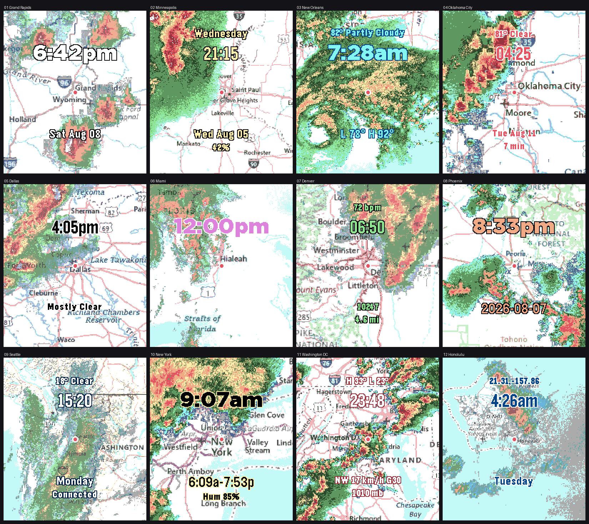

# NOAA US Weather Radar ⛈️

## What is this?

Your watch can tell you it's raining. Wouldn't it be better if it showed you the *storm*? NOAA US Weather Radar is a watchface for [Pebble](https://repebble.com/) watches that fills the screen with a live weather radar map centered on your location — the same NOAA base reflectivity imagery you'd check on your phone, composited over a USGS topographic basemap, refreshed on an interval you choose (every 5 minutes to hourly, 10 by default), with your time, date, health stats, and weather drawn right on top.

Your phone does the heavy lifting: it figures out where you are, fetches the map imagery and National Weather Service data, blends the radar into the basemap, squeezes the result down to something a tiny watch can decode, and streams it over Bluetooth. The watch just draws it.



### Features

- 🗺️ **Full-screen live radar** over a topographic basemap, with a marker at your exact position
- 📍 **Follows you around** — the map re-centers when you move, or set a fixed location manually
- 🔍 **Three zoom levels** — City (100 km), State (250 km), or Region (500 km) across the screen
- 📝 **Four configurable text lines** — Time, Date, Weekday, Steps, Distance, Calories, Sleep, Heart Rate, Battery, Bluetooth, Radar Age, Lat/Long, and more, each with its own font size (including "shrink to fit")
- 🖍️ **Custom text and outline colors** — every line is drawn with a halo outline so it stays readable over busy map areas, and both colors are yours to pick
- 🌦️ **Weather from the National Weather Service** — current conditions, temperature, feels like, dew point, humidity, wind, pressure, today's forecast, tonight/tomorrow, high/low, and active alerts, in imperial or metric units
- 🌅 **Sunrise/sunset and golden hour** — computed on your phone from your exact position rather than fetched, so they don't depend on a nearby weather station, and shown in your watch's own 12- or 24-hour format
- ⚠️ **Alert-aware lines** — show your normal weather until a watch or warning takes over the line, and alerts clear themselves when they expire even if your phone is out of reach
- 🗓️ **Severe alerts in your timeline** — tornado, severe thunderstorm, flash flood and other severe or extreme NWS alerts show up as timeline pins that run for as long as the alert does, then quietly age out on their own. Pins can take several minutes to arrive, so treat them as a record of what's in force, not as a siren
- 🎨 **Translucent, opaque, or disabled radar** — or use it as a plain topo map face
- 📶 **Bluetooth badge** — a Bluetooth rune appears in the top-left the moment your phone goes out of range, so you know the radar has stopped updating
- 🔋 **Frugal by design** — imagery is blended and re-encoded to 16 colors before it ever leaves the phone, a refresh that comes back looking identical isn't sent to the watch at all, and weather is only fetched if a weather line is actually configured (or timeline pins are on, which needs alerts either way)

Radar, basemap, and weather data come from [NOAA](https://mapservices.weather.noaa.gov/), the [USGS National Map](https://basemap.nationalmap.gov/), and [api.weather.gov](https://www.weather.gov/documentation/services-web-api) — all free, no API keys. These services are US-only, so there's no imagery or weather outside the United States.

## Installation

Build it with the [Pebble SDK](https://developer.rebble.io/developer.pebble.com/sdk/index.html). Prebuilt `.pbw` bundles, once any are published, will appear on the [Releases page](../../releases) for side-loading.

```bash
# Clone the repository
git clone https://github.com/leoherzog/pebble-noaa-radar-watchface.git
cd pebble-noaa-radar-watchface

# Install the JS dependencies (bundled into the phone-side code)
npm install

# Build it
pebble build

# Install to your watch...
pebble install --phone <phone-ip>

# ...or try it in the emulator
pebble install --emulator emery
```

## Requirements

- A color Pebble: Pebble Time or Time Steel (`basalt`), Pebble Time 2 (`emery`), or Pebble Round 2 (`gabbro`)
- A location in the United States (that's where NOAA's radar coverage ends!)
- The Pebble phone app, for location, networking, and settings

Pebble Time Round (`chalk`) isn't supported. Its 180×180 screen is too small on two counts: text on the top and bottom lines gets clipped by the curve of the display, and there isn't reliably enough memory to decode a map image during heavy weather — which is when you'd want it most.

## Configuration

Open the watchface's settings in the Pebble phone app.

| Setting | Description |
|---------|-------------|
| Radar | Translucent, Opaque, or Disabled |
| Zoom | City (100 km), State (250 km), or Region (500 km) |
| Refresh Interval | How often the radar, weather, and alerts refresh: 5, 10, 15, 20, 30, or 60 minutes (default 10) |
| Use GPS | Follow the phone's location, or turn off to enter a fixed latitude/longitude |
| Top/Bottom Lines 1 & 2 | What each of the four text lines shows |
| Line Sizes | Extra Small through Extra Large, fixed or shrink-to-fit |
| Text Color | Color of the four text lines (default black) |
| Text Outline Color | Color of the halo drawn under the glyphs (default white) |
| Bluetooth Disconnection Indicator | Show or hide the top-left badge shown while the phone is out of range (default on) |
| Units | Imperial (°F, mph, inHg) or Metric (°C, km/h, mb) |
| Send Severe Weather Alerts to Timeline | Push severe and extreme NWS alerts into your Pebble timeline as pins (default on) |

The two outer lines default to None, so out of the box you get a clean two-line face: time up top, date down below, radar behind.

## License

The MIT License (MIT)

Copyright © 2026 Leo Herzog

Permission is hereby granted, free of charge, to any person obtaining a copy of this software and associated documentation files (the "Software"), to deal in the Software without restriction, including without limitation the rights to use, copy, modify, merge, publish, distribute, sublicense, and/or sell copies of the Software, and to permit persons to whom the Software is furnished to do so, subject to the following conditions:

The above copyright notice and this permission notice shall be included in all copies or substantial portions of the Software.

THE SOFTWARE IS PROVIDED "AS IS", WITHOUT WARRANTY OF ANY KIND, EXPRESS OR IMPLIED, INCLUDING BUT NOT LIMITED TO THE WARRANTIES OF MERCHANTABILITY, FITNESS FOR A PARTICULAR PURPOSE AND NONINFRINGEMENT. IN NO EVENT SHALL THE AUTHORS OR COPYRIGHT HOLDERS BE LIABLE FOR ANY CLAIM, DAMAGES OR OTHER LIABILITY, WHETHER IN AN ACTION OF CONTRACT, TORT OR OTHERWISE, ARISING FROM, OUT OF OR IN CONNECTION WITH THE SOFTWARE OR THE USE OR OTHER DEALINGS IN THE SOFTWARE.

## About Me

<a href="https://herzog.tech/" target="_blank">
  <picture>
    <source media="(prefers-color-scheme: dark)" srcset="https://herzog.tech/signature/link-light.svg.png">
    <source media="(prefers-color-scheme: light)" srcset="https://herzog.tech/signature/link.svg.png">
    
  </picture>
</a>
<a href="https://mastodon.social/@herzog" target="_blank">
  <picture>
    <source media="(prefers-color-scheme: dark)" srcset="https://herzog.tech/signature/mastodon-light.svg.png">
    <source media="(prefers-color-scheme: light)" srcset="https://herzog.tech/signature/mastodon.svg.png">
    
  </picture>
</a>
<a href="https://github.com/leoherzog" target="_blank">
  <picture>
    <source media="(prefers-color-scheme: dark)" srcset="https://herzog.tech/signature/github-light.svg.png">
    <source media="(prefers-color-scheme: light)" srcset="https://herzog.tech/signature/github.svg.png">
    
  </picture>
</a>
<a href="https://keybase.io/leoherzog" target="_blank">
  <picture>
    <source media="(prefers-color-scheme: dark)" srcset="https://herzog.tech/signature/keybase-light.svg.png">
    <source media="(prefers-color-scheme: light)" srcset="https://herzog.tech/signature/keybase.svg.png">
    
  </picture>
</a>
<a href="https://www.linkedin.com/in/leoherzog" target="_blank">
  <picture>
    <source media="(prefers-color-scheme: dark)" srcset="https://herzog.tech/signature/linkedin-light.svg.png">
    <source media="(prefers-color-scheme: light)" srcset="https://herzog.tech/signature/linkedin.svg.png">
    
  </picture>
</a>
<a href="https://hope.edu/directory/people/herzog-leo/" target="_blank">
  <picture>
    <source media="(prefers-color-scheme: dark)" srcset="https://herzog.tech/signature/anchor-light.svg.png">
    <source media="(prefers-color-scheme: light)" srcset="https://herzog.tech/signature/anchor.svg.png">
    
  </picture>
</a>
<br />
<a href="https://herzog.tech/$" target="_blank">
  <picture>
    <source media="(prefers-color-scheme: dark)" srcset="https://herzog.tech/signature/mug-tea-saucer-solid-light.svg.png">
    <source media="(prefers-color-scheme: light)" srcset="https://herzog.tech/signature/mug-tea-saucer-solid.svg.png">
    
  </picture>
  Found this helpful? Buy me a tea!
</a>
